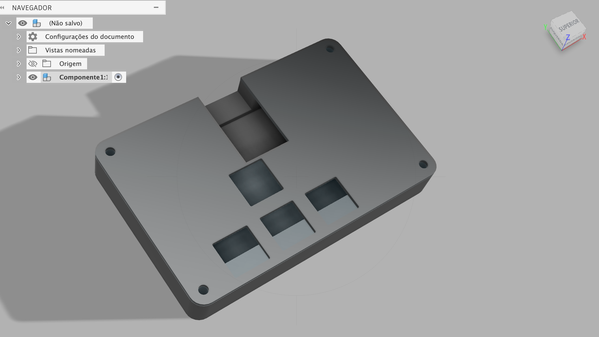
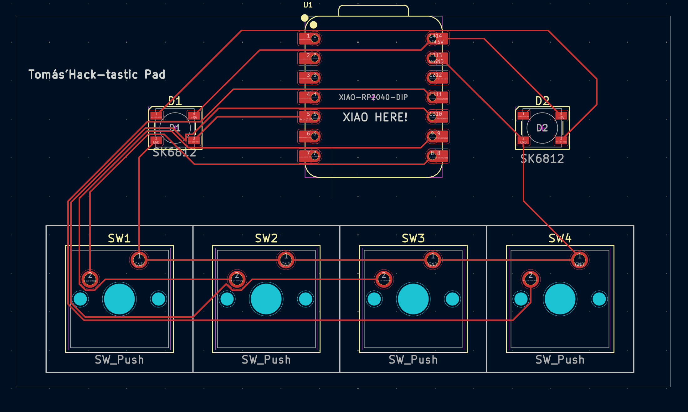
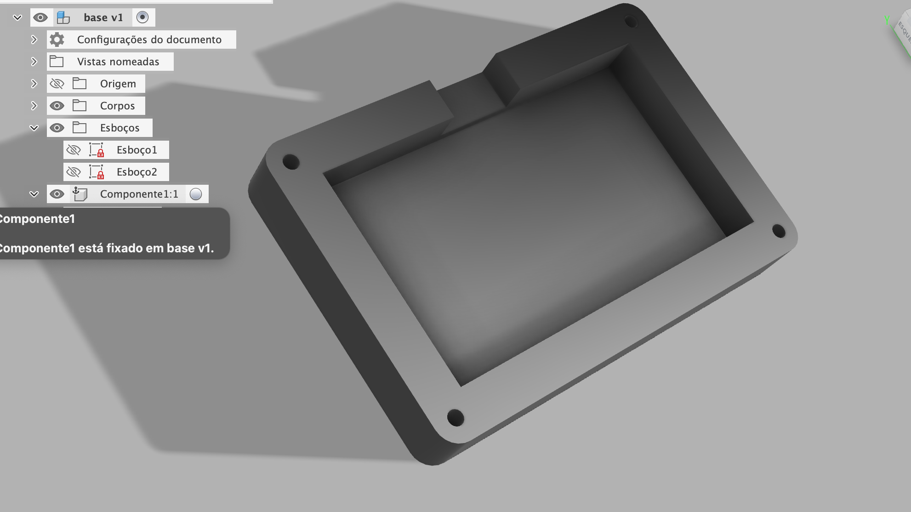

# Tom's Hack-tastic Pad 🎓✨

**4-key macropad for students with Pomodoro & Quick Notes**

Tom's Hack-tastic Pad is a compact 4-key macropad designed to help students **stay focused and organized**.  
You can start/stop a Pomodoro, create quick notes, and open the Notes app with a single keypress.

---

## 📁 Project Structure

- **Firmware/** → main.py  
- **CAD/** → CAD files  
- **PCB/** → PCB files  
- **images/** → screenshots  
- **README.md** → this file

---

## 🔑 Key Functions

| Key | Function |
|-----|---------|
| 1 | Start Pomodoro |
| 2 | Stop Pomodoro |
| 3 | Quick Note |
| 4 | Open Notes App |

---

---

## 🛠️ Bill of Materials (BOM)

| Part | Quantity | Notes |
|------|---------|------|
| Seeed XIAO RP2040 | 1 | Main microcontroller |
| Mechanical switches | 4 | For keys |
| Keycaps | 4 | Standard size |
| Wires / connectors | As needed | For connections |
| 3D-printed case | 1 | Printed using your CAD files |

---

## ⚡ How It Works

- Firmware written in **KMK + CircuitPython** for **RP2040**  
- Each key triggers **macros** simulating computer actions  
- Even without hardware, `main.py` shows the full logic of the macropad
