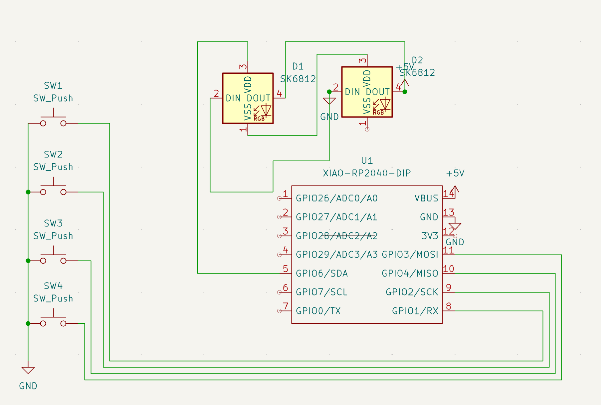
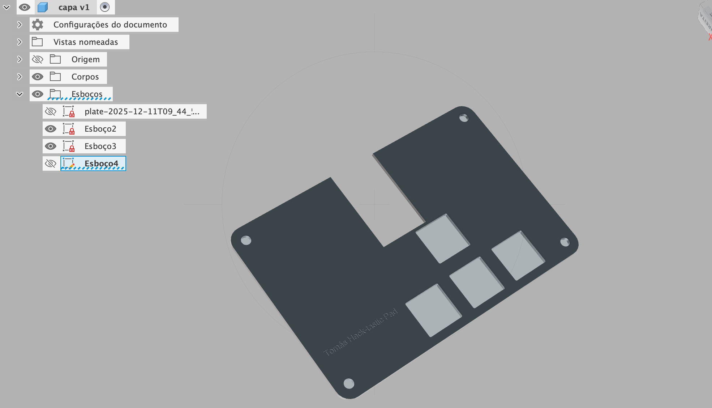

# Tom's Hack-tastic Pad 

**4-key macropad for students with Pomodoro & Quick Notes**

Tom's Hack-tastic Pad is a compact 4-key macropad designed to help students **stay focused and organized**.  
You can start/stop a Pomodoro, create quick notes, and open the Notes app with a single keypress.

---

## 📁 Project Structure

- **Firmware/** → `main.py`  
- **CAD/** → Case CAD files (STEP)  
- **PCB/** → PCB design files (KiCad)  
- **images/** → Screenshots and renders  
- **README.md** → This file

---

## 🔑 Key Functions

| Key | Function |
|-----|---------|
| 1 | Start Pomodoro |
| 2 | Stop Pomodoro |
| 3 | Quick Note |
| 4 | Open Notes App |

---

## 📸 Project Images

---

## 🛠️ Bill of Materials (BOM)

Please see the **BOM.csv** file for all parts used.  

Current parts include:

- XIAO RP2040 DIP (microcontroller)  
- 4x SW_Push (keyboard switches)  
- 2x SK6812 MINI LEDs (RGB/neopixels)  
- Optional: Display (can be added later if needed)  
- Wires / connectors  
- 3D-printed case  

---

## ⚡ How It Works

- Firmware written in **KMK + CircuitPython** for **RP2040**
- Each key triggers **macros** simulating computer actions
- Even without hardware, `main.py` shows the full logic of the macropad
